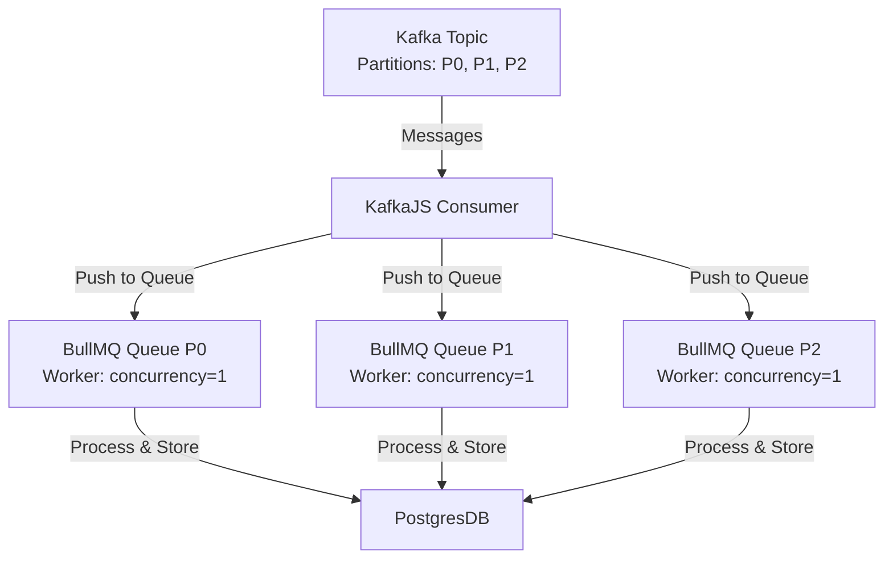

## Introduction

Picture this: you’re building a high-throughput system with **KafkaJS**, processing thousands of messages per second to power a real-time platform. Everything runs smoothly until a slow database query or external API call sneaks into your Kafka consumer’s `eachMessage` handler. Suddenly, your consumer lags, messages pile up, and Kafka triggers a rebalance, disrupting your entire system. This is exactly what I faced while working on **YaraConnect**, a retailer-support platform where we handled thousands of daily transactions across 9 countries to connect farmers and retailers.

**KafkaJS** is a modern JavaScript library for interacting with Apache Kafka, a distributed streaming platform designed for high-throughput, fault-tolerant messaging. But when slow tasks bog down your consumer, even Kafka’s robustness can’t save you from latency and rebalancing chaos. That’s where **BullMQ**, a powerful Node.js queue library backed by Redis, comes in. BullMQ allows you to offload heavy tasks to a queue, letting your Kafka consumer focus on fetching messages while workers handle the heavy lifting.

In this two-part series, I’ll share how I tackled slow message processing at YaraConnect by integrating **KafkaJS** with **BullMQ** in a **NestJS** app. Part 1 explains the problem of slow tasks, introduces BullMQ as a solution. Part 2 dives into the code, including setup, and error handling. Whether you’re new to Kafka or a seasoned developer, you’ll learn practical techniques to build faster, more reliable message-processing systems. Let’s get started! 🚀

## The Problem: Slow Message Processing in KafkaJS

To grasp why slow tasks wreak havoc, let’s break down how KafkaJS and Kafka work. **KafkaJS** is a JavaScript client for Apache Kafka, enabling Node.js apps to produce and consume messages from Kafka topics. A Kafka topic is divided into **partitions**, each holding an ordered sequence of messages (e.g., offset 0, 1, 2). Consumers in a **consumer group** subscribe to topics, with each consumer handling one or more partitions. Kafka ensures messages within a partition are processed in order, making it ideal for use cases like transaction processing.

In KafkaJS, you define a consumer with the `eachMessage` handler to process messages:

```javascript
await consumer.run({
  eachMessage: async ({ topic, partition, message }) => {
    console.log(`Processing message: ${message.value.toString()}`);
    await processRetailerTransaction(message.value.toString()); // Slow task
  },
});
```

This works great—until `processRetailerTransaction` takes too long. At YaraConnect, we had a task that queried a PostgresDB, calling Loyalty Core to evaluate the rules (I'll talk about this in a future article), and then called an external API to get Product information, to get Coupon,..., and all of them take time to perform. With thousands of messages flooding in, our consumer couldn't keep up. Here's why this is a problem:

- **Consumer Timeout**: Kafka expects consumers to send `heartbeats` to confirm they're alive. If a task takes too long, the consumer misses heartbeats, and Kafka assumes it's dead, triggering a **rebalance**—reassigning messages to other consumers. This can cause delays or even lost messages. (Refer this [doc](https://kafka.js.org/docs/2.0.0/consuming#a-name-each-message-a-eachmessage))
- **Backlog Buildup**: Slow processing creates a backlog, increasing latency and potentially overwhelming your system.
- **Order Risks**: Kafka guarantees message order within a partition (e.g., offset 1 processed before offset 2). A bogged-down consumer might tempt you to scale with multiple consumers, which can disrupt this order if not handled carefully.

In short, a single slow task in `eachMessage` can grind your system to a halt. I tried quick fixes like sending heartbeats early or increasing timeouts, but they were merely temporary solutions. Let me show you the pros and cons of the solutions I tried, and we will see which one is the better solution.


## Approach 1: Sending Heartbeats Early

To send heartbeats early, we can do something like this:

```javascript
await consumer.run({
  autoCommit: false,
  eachMessage: async ({ topic, partition, message, heartbeat }) => {
    console.log(`Processing offset ${message.offset}`);
    await heartbeat(); // Sending heartbeat early to avoid rebalance
    await processRetailerTransaction(); // Slow task
    await consumer.commitOffsets([{ topic, partition, offset: (Number(message.offset) + 1).toString() }]);
  },
});
```

This approach use `eachMessage` with `autoCommit: false`, send a heartbeat before processing the message, and commit the offset after the slow task is done.

**Pros**:

1. **Precise control of commit offsets**: With `autoCommit: false`, we can control when to commit the offset. This ensures the message is marked as "processed" when `processRetailerTransaction` is done. It reduces the lost messages problem if the consumer crashes.

2. **Avoid rebalance**: With `heartbeat()`, we tell Kafka coordinator that the consumer is alive even `processRetailerTransaction` takes too long.

3. **Simple**: This is the simplest approach, we don't need to write any additional code.

**Cons**:

1. **The risk of rebalance still exists**: Although sending `heartbeat()` early reduces the risk of rebalance, if `someLongRunningTask` takes longer than `sessionTimeout`, Kafka may still consider the consumer `dead` and trigger a rebalance.

To fix the above cons, I have tried with the 2nd approach below.

## Approach 2: Combine approach 1 with increase `sessionTimeout`


```javascript
await consumer.run({
  autoCommit: false,
  sessionTimeout: 60000, // 1 minutes
  eachMessage: async ({ topic, partition, message, heartbeat }) => {
    console.log(`Processing offset ${message.offset}`);
    await heartbeat(); // Sending heartbeat early to avoid rebalance
    await processRetailerTransaction(); // Slow task
    await consumer.commitOffsets([{ topic, partition, offset: (Number(message.offset) + 1).toString() }]);
  },
});
```

This approach can resolve the cons of the first approach, but it has a few drawbacks:

1. **Increased latency**: Since `processRetailerTransaction` takes longer (it can be more > 1 minute), the consumer will wait for the task to finish before processing the next message. This increases the latency and can cause delays.

2. **Potential error in `someLongRunningTask`**: If `someLongRunningTask` throws an exception and is not handled properly (e.g. missing `try-catch`), the consumer may crash or skip the message without committing the offset. This results in the message being stuck (not processed again unless the consumer is restarted).

These approaches were like putting a Band-Aid on a broken leg—functional but far from ideal. I needed a solution that was robust, scalable, and didn’t choke on slow tasks.

## Approach 3: Offloading Heavy Tasks with BullMQ and Redis

After countless hours of scouring docs, chugging coffee, and muttering “there’s gotta be a better way,” I struck gold with Approach 3—offloading heavy tasks to a separate queue using BullMQ and Redis. Picture this as handing off your dirty laundry to a super-efficient dry cleaner while you focus on looking fabulous. BullMQ, a Node.js queue library backed by Redis, lets you push slow tasks to a queue and process them with dedicated workers, freeing your Kafka consumer to zip through messages like a caffeinated cheetah. 😎

Here’s the gist: instead of processing `processRetailerTransaction` in the `eachMessage` handler, the consumer pushes the task to a **BullMQ** queue. A separate worker (or workers) then picks up the task, queries the database, hits the API, and does all the heavy lifting without slowing down the consumer. This approach keeps the consumer lean and mean, fetching messages at full speed while **BullMQ** handles the grunt work.

**How It Works**:

- The KafkaJS consumer grabs a message and pushes it to a BullMQ queue with metadata (e.g., topic, partition, offset).
- A BullMQ worker processes the task asynchronously, storing results in PostgresDB or triggering further actions.

**Pros**:

- **Lightning-fast consumer**: Offloading tasks keeps the consumer focused on fetching messages, preventing timeouts and rebalances.
- **Scalability**: Multiple queues and workers can handle tasks in parallel across partitions, leveraging Kafka’s parallelism.
- **Robustness**: BullMQ supports retries, error handling, and job monitoring, making it ideal for unreliable APIs or flaky databases

**Cons**:

- **Complexity**: Managing multiple queues and Redis adds infrastructure overhead
- **Redis dependency**: We need a Redis instance, which might be new for some teammates

**Why It Rocks**: At YaraConnect, we already had Redis running in our cluster. So we don't need to worry about the infrastructure overhead. And this approach worked like a charm, resolve the rebalance issue. Plus, BullMQ’s retry mechanism saved us from flaky API calls—talk about a win! 🎉. Apart from that, with BullMQ Dashboard we can monitor the queues and workers as well.

Here’s a sneak peek at the data flow:



Now, it's time to take a break. In Part 2, we’ll dive into the NestJS code to set up KafkaJS, BullMQ, and Redis, plus tips for error handling and scaling. Stay tuned!

---

**Disclaimer**: I’m no Kafka guru—just a developer who wrestled with slow tasks and lived to tell the tale! 😄 This is my journey of solving a real-world problem at YaraConnect, and I’d love to hear your thoughts, tips, or alternative approaches. Drop your feedback or questions in the comments, and let’s learn together!

---

*Continue to [Part 2](#)* for the implementation and lessons learned. 